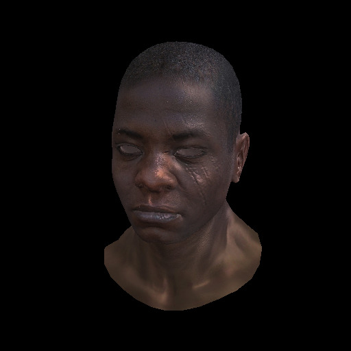

# parallellines

*Image rendered with this rasterizer.*

**GPU software rasterizer** made by following the course https://github.com/ssloy/tinyrenderer and then porting the code to the GPU with CUDA.

The intent behind this project was to brush up on my C++ skills and get a fuller understanding of how graphics programming works on a lower level — I'm pretty happy with the results!

## Usage

### Demo

On Windows: if you have CUDA installed, compile with `make` (you might have to do this from the Visual Studio 2022 Developer Command Prompt) then run with `parallelllines.exe [render | wireframe] WIDTH HEIGHT DIR_PATH` where `WIDTH` and `HEIGHT` are the width and height of your output image, and `DIR_PATH` is the path to a directory that contains:
- A wavefront model file named `model.obj`
- A TGA diffuse texture file named `diffuse.tga`
- A TGA specular texture file named `specular.tga`
- A TGA normal map file named `normal_map.tga`
*for the wireframe option, you only need the model.*

Your model will be rendered using the provided implementation for a PhongShader, and the output saved to `images/out.tga`. I recommend the software JPEGView to view TGA images.

### Writing shaders

See `shaders.cuh` for an example.

You can write a shader by defining a class that inherits from `IShaderData` and another that inherits from `IShader<IShaderData>`.

`IShaderData`: Holds shader uniforms and transformation matrices. 
- Data here is shared between all faces/vertices. 
- You can define a constructor to initialize any uniforms and matrices.
- You can freely define two transformation matrices: projection and view. You can use `renderer::projection(float c)` and `renderer::look_at(Vec3f eye, Vec3f target, Vec3f up)` to create these.
- The property `transform` exposes a matrix that holds the pre-computesd multiplication of all transform matrices in the correct order.

`IShader<IShaderData>`: Implements the actual vertex and fragment shaders.
- Data here is shared per face, so you can define "varying" variables (although the auto-interpolation of usual shading languages doesn't happen).
- Data from the given `IShaderData` is accessible from the the `uniform` property.
- All functions here are called from the GPU so must be CUDA device compatible.

### Rendering

See `main.cuh` for an example.

**`renderer::render<Shader, ShaderData>(output, model)` will render the `model` to the `output` image, using the shaders defined through `Shader` and `ShaderData`.**

`TGAImage output(X, Y, TGAImage::RGB)` creates an image with `X` and `Y` dimensions that can then be used as an output.

`Model model("path_to_model.obj")` loads the wavefront model at `path_to_model.obj` into the variable `model`.

`model.load_texture("path_to_texture.tga", TextureType::DIFFUSE)` loads the texture at `path_to_texture.tga` as diffuse texture into the model in `model`. Alternative texture types are `TextureType::SPECULAR` and `TextureType::NORMAL_MAP`.

## Authorship

### Code

`geometry.*`, `tgaimage.*` and `model.*` are forked from an initial version by [ssloy](https://github.com/ssloy/) with many changes to better fit my version of the rasterizer.

All other files are written completely by me.

### Models
- `african_head` and `diablo3_pose`: provided in ssloy's course at https://github.com/ssloy/tinyrenderer
- `debug_cube/cube.obj` and `debug_cube/texture.tga`: https://github.com/garykac/3d-cubes
- `debug_cube/tex_DebugUVTiles.tga`: https://github.com/BlueG/DebugTextures  

## Resources
- https://github.com/ssloy/tinyrenderer
- https://jtsorlinis.github.io/rendering-tutorial/
- https://www.songho.ca/opengl/gl_camera.html
- https://developer.nvidia.com/blog/even-easier-introduction-cuda/
- \+ many posts in Stack Overflow and Nvidia developer forums